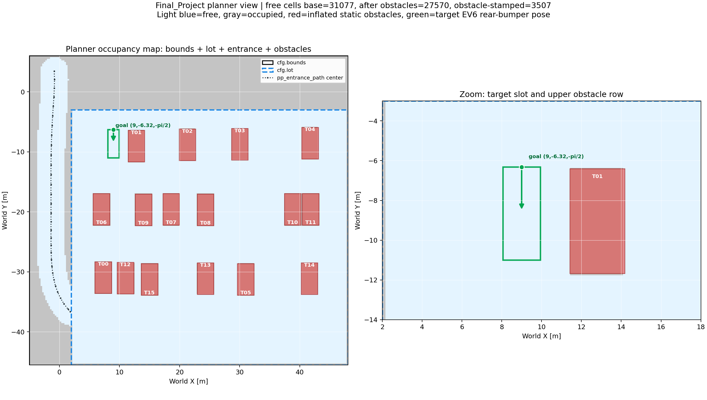
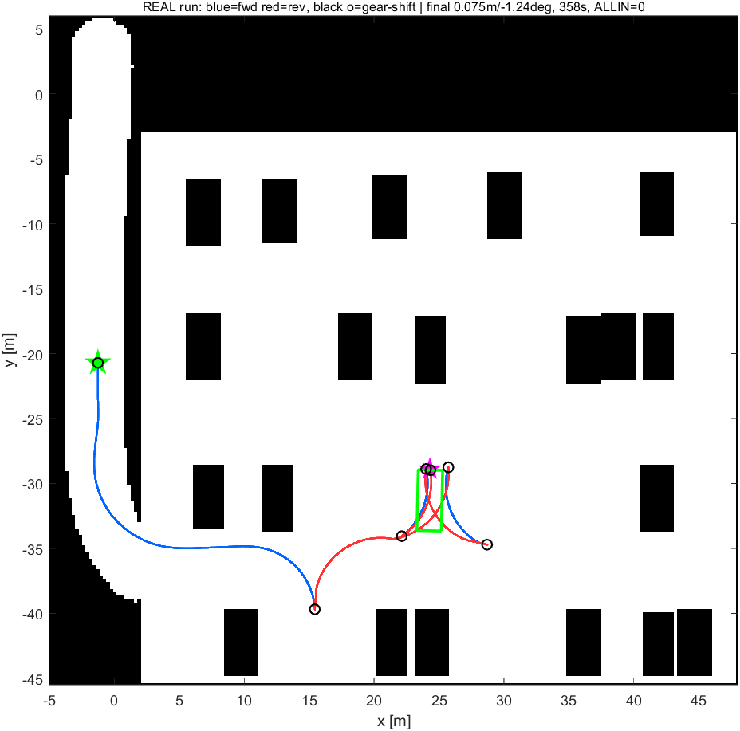
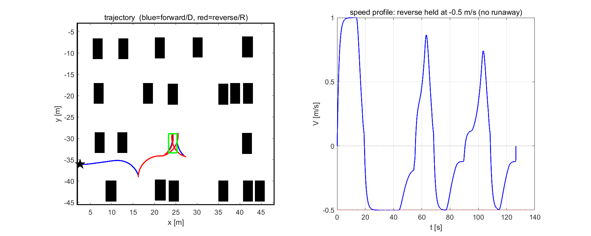
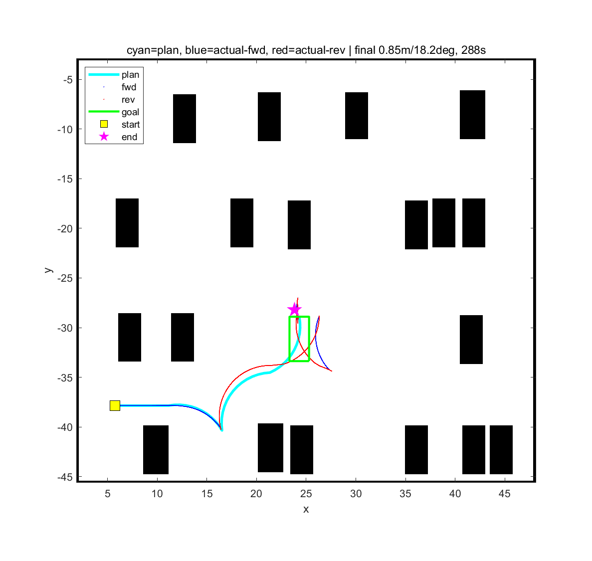
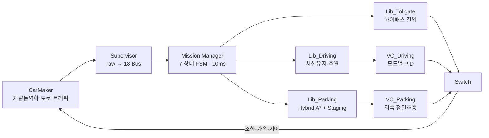

# ADAS 통합 자율주행 시스템 (IVS-CarMaker-ADAS)

> **CarMaker 14.1.2 + MATLAB/Simulink** — 다차로 주행 · 하이패스 톨게이트 · 정밀 자동주차를 하나의 폐루프 시나리오로 통합한 자율주행 프로젝트

HL만도 & HL클레무브 IVS 과정(K-Digital Training) 6인 팀 파이널 프로젝트 (2026.05.21 ~ 06.05, 2주) + **프로젝트 종료 후 전체 스택 개인 재구현**.

- 원본 팀 저장소([`ChungRyeung/26HL_IVS_ADAS`](https://github.com/ChungRyeung/26HL_IVS_ADAS), private)의 정리 미러(`team-project/`)와 개인 재구현(`solo-reimplementation/`)을 커밋 히스토리째 통합한 포트폴리오 저장소입니다.
- 담당: **조정빈 ([@jb-cho55](https://github.com/jb-cho55)) — 팀장 · 주차 알고리즘(Lib_Parking)**

## 🎬 데모

▶️ **[통합 주행 데모 영상 (주행 → 톨게이트 → 주차)](docs/media/driving_demo.mp4)**

| 주차 플래너 맵 (Hybrid A* + 장애물) | 실제 주행 궤적 |
|:---:|:---:|
|  |  |
| **후진주차 경로 검증 (오프라인)** | **궤적 분석** |
|  |  |

## 📌 프로젝트 개요

기능별로 따로 개발되던 ADAS 시나리오(주행/톨게이트/주차)를 **하나의 미션에서 자동 전환**되는 통합 시스템으로 구축했습니다.

**미션**: 다차로 주행(13 m/s, 차선유지·추월) → 하이패스 톨게이트(차선 정렬·단계 감속 통과) → 주차장 진입 → 정밀 주차(29 슬롯 · 21 장애물 차량 · ±90°/평행)



- Mission Manager FSM이 10 ms마다 ego 위치(geo-fence)로 시나리오를 판정, 활성 시나리오 1개만 배타 실행 → 결정론적 전환으로 재현·디버깅 용이
- 알고리즘을 `.m` 함수로 분리해 **1인 1모듈 · Git 충돌 없는 병렬 개발** (아키텍처 상세: [`team-project/index/Final_Project_Architecture.md`](team-project/index/Final_Project_Architecture.md))

## 🅿️ 내 역할 — 팀장 · 주차 알고리즘 (Lib_Parking)

주차 파이프라인 FSM: `INIT → PLAN(Hybrid A* + 직진) → TRACK(Pure Pursuit) → CORRECT(committed Reeds-Shepp 반복) → PARKED`

| 알고리즘 | 내용 |
|---|---|
| **Hybrid A* 경로계획** (AG-004) | 전·후진 모두 고려한 격자 탐색으로 충돌 회피 경로 생성 |
| **Staging 주차 전략** (AG-005) | 목표 5 m 전 staging pose에서 헤딩 정렬 후 직진 진입 — 진입 방향 자동 선택(통로 뒤=전진/앞=후진), hug-right로 기동 여유 확보 |
| **Reeds-Shepp 정밀 정렬** (AG-006) | committed RS 곡선 반복 + 기어 FSM(정지 시에만 D↔R 전환)으로 채터링 제거 |

**정량 성과** (29 슬롯 · 21 장애물 환경):

| 지표 | 결과 |
|---|---|
| 베이스라인(순수 추종) | 19좌표 중 14 PASS — 가장자리·측면충돌 5개 케이스 수십 m 이탈 |
| **Staging 적용 후** | 실패 케이스 회복: **T05 51.6 m → 0.02 m**, T10 20.3 m → 0.02 m, T14 3.5 m → 0.04 m |
| 최종 정밀도 | 최대 오차 **0.16 m** (대부분 0.1 m 이내), 목표 공차 0.3 m / 5° |

주요 코드: [`parking_scenario_fcn.m`](team-project/02_Carmaker_project/Practice_sample/src_cm4sl/functions/parking_scenario_fcn.m) · [`vehicle_controller_parking_fcn.m`](team-project/02_Carmaker_project/Practice_sample/src_cm4sl/functions/vehicle_controller_parking_fcn.m) · 개발 로그: [`PARKING_PROGRESS.md`](team-project/02_Carmaker_project/Practice_sample/FP_campaign/PARKING_PROGRESS.md)

> ℹ️ 주차 모듈(Lib_Parking + VC_Parking)은 주차 컨트롤러 담당 팀원([@hackisha](https://github.com/hackisha))과 **페어 프로그래밍**으로 개발했으며, 팀 저장소의 주차 커밋은 페어 세션 환경에서 @hackisha 계정 명의로 푸시되었습니다.

## 🔧 프로젝트 종료 후 — 자율주행 스택 개인 재구현 (`solo-reimplementation/`)

팀 프로젝트가 끝난 뒤, 같은 미션을 **처음부터 혼자 다시 구현**했습니다 (본인 단독 커밋 11개, 2026.06.05~06).

- **EML 모듈 9개 직접 작성**: `objmgr`(인지 파서: 정적 16 / 이동 13 객체) · `modemgr`(미션 FSM) · `mapmgr` · `pathplan` · `trajplan` · `latctrl` · `lonctrl` · `safety` + `parking_wrap→pp_parking`(Hybrid A* + Reeds-Shepp 후진주차) — 소스: [`docs/_modules/`](solo-reimplementation/docs/_modules/)
- **전체 미션 완주**: 주행 → 톨게이트(1차선 무정지) → 추월 → 분기 → 주차장 입구 정지 → 후진주차 핸드오프
- **측정 기반 개발**: `Sensor.Collision` 기반 진짜 충돌 로깅 + 평가 하네스([`ivs_eval.m`](solo-reimplementation/02_Carmaker_project/Practice_sample/src_cm4sl/dev/analysis/ivs_eval.m)) 구축, 시나리오 확률 변동성 때문에 **N≥8 반복 실험**으로만 개선을 판정
- **충돌 저감**: 전방 한정 AEB(후방 데드락 해소), 정지거리 기반 차간(d_safe = 4 + 0.12v²), 곡률 기반 감속(a_lat ≤ 3) → 입구 도달률 0% → **100%**
- 제약 준수: 좌표 하드코딩 금지(인지 기반), `AccelCtrl.DesiredAx`·`rz_ext`·`SelectorCtrl` 명령만 사용, TestRun·차량 게인 수정 불가
- 엔지니어링 로그(가설→실험→롤백 기록): [`SESSION_HANDOFF_2026-06-06.md`](solo-reimplementation/docs/SESSION_HANDOFF_2026-06-06.md) · [`SESSION_HANDOFF_2026-06-07.md`](solo-reimplementation/docs/SESSION_HANDOFF_2026-06-07.md)

## 🤝 협업

6인 팀 · 1인 1모듈 · 기능 브랜치 + PR 워크플로 (**PR 22개 · 브랜치 26개**). 역할 분담, 브랜치 전략, PR 타임라인: **[docs/COLLABORATION.md](docs/COLLABORATION.md)**

## 📂 저장소 구조

```
team-project/            팀 최종본(main) 미러 — 커밋 히스토리·저자 보존, 빌드 산출물 제거
solo-reimplementation/   종료 후 개인 재구현 — 본인 단독 커밋 히스토리
docs/                    협업 기록 · 데모 미디어
```

## ⚖️ 출처 및 저작권

- `team-project/`는 6인 공동 저작물인 private 팀 저장소의 정리 미러이며, 모든 커밋의 원저자 표기를 보존했습니다.
- IPG CarMaker 매뉴얼 및 교육기관 실습 자료(PDF)는 저작권 보호를 위해 히스토리에서 제거했습니다.
- CarMaker 프로젝트 기본 환경은 교육과정에서 제공되었습니다 (`junho.lee` 명의 베이스 커밋).
