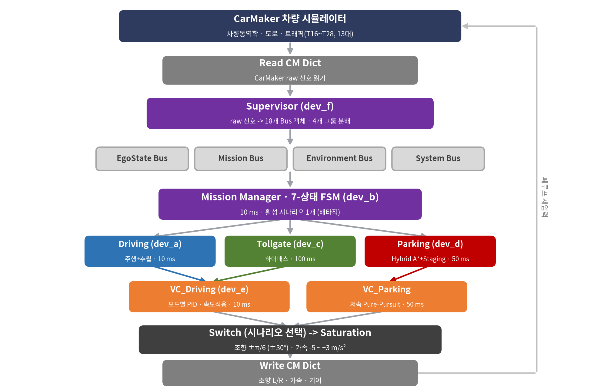
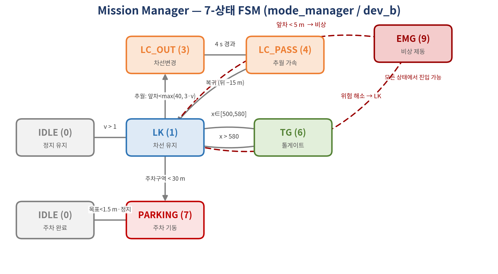
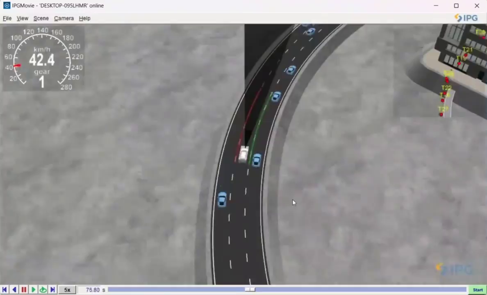
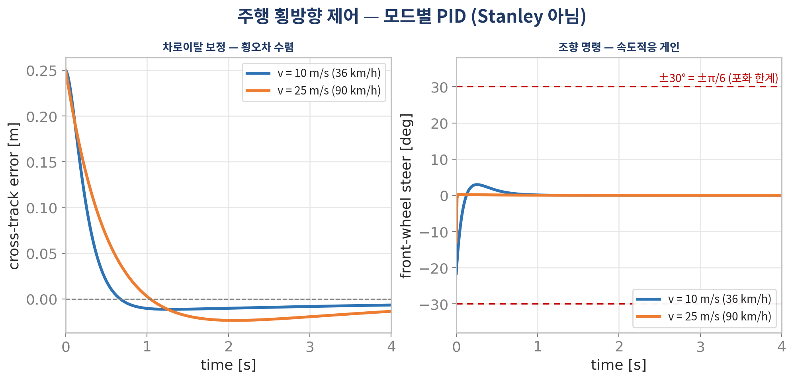
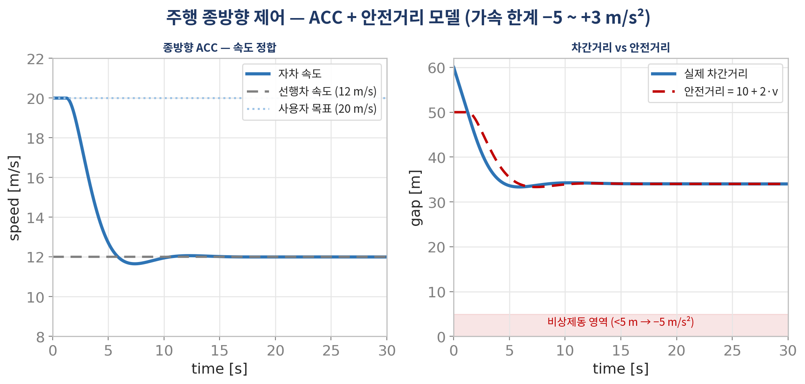
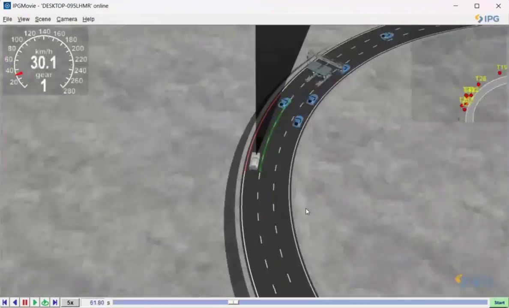
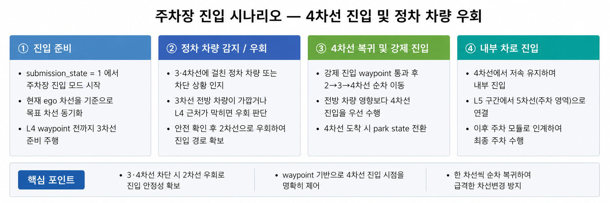
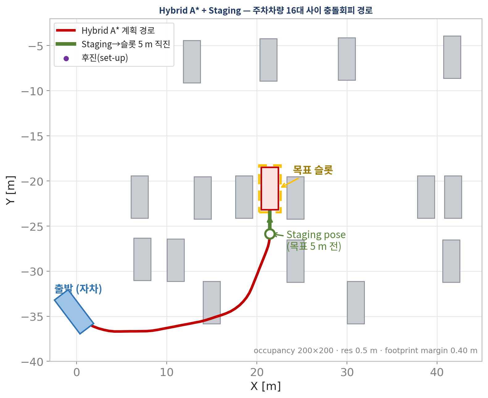
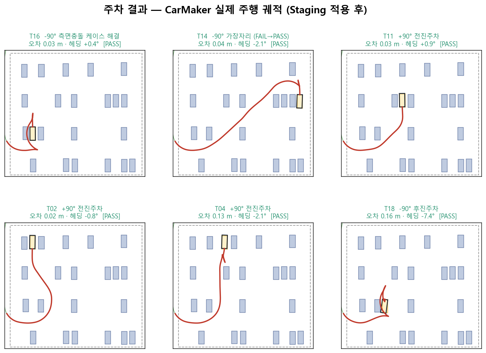

# ADAS 통합 자율주행 시스템 (IVS-CarMaker-ADAS)

> **CarMaker 14.1.2 + MATLAB/Simulink** — 다차로 주행 · 하이패스 톨게이트 · 정밀 자동주차를 하나의 폐루프 시나리오로 통합한 자율주행 프로젝트

HL만도 & HL클레무브 IVS 과정(K-Digital Training) 6인 팀 파이널 프로젝트 (2026.05.21 ~ 06.05, 2주).

- 원본 팀 저장소([`ChungRyeung/26HL_IVS_ADAS`](https://github.com/ChungRyeung/26HL_IVS_ADAS), private)의 정리 미러(`team-project/`)와 프로젝트 기간 중 직접 구현한 개인 버전(`my-implementation/`)을 커밋 히스토리째 통합한 포트폴리오 저장소입니다.
- 담당: **조정빈 ([@jb-cho55](https://github.com/jb-cho55)) — 팀장 · 주차 알고리즘 (Hybrid A* + Staging + Reeds-Shepp)**

▶️ **[통합 주행 데모 영상 — 주행 → 톨게이트 → 주차 (클릭 시 재생)](docs/media/driving_demo.mp4)**

## 🏗️ 시스템 구성

CarMaker가 차량 동역학·도로·트래픽(13대)을 시뮬레이션하고, Supervisor가 raw 신호를 18개 Bus로 정리하면, Mission Manager(7-상태 FSM, 10 ms)가 ego 위치(geo-fence) 기준으로 주행/톨게이트/주차 중 하나만 배타적으로 실행합니다. 각 시나리오의 조향·가속·기어 명령은 Switch를 거쳐 CarMaker로 되돌아가는 폐루프 구조입니다.





- 결정론적 시나리오 전환 → 재현·디버깅 용이
- 알고리즘을 `.m` 함수로 분리해 **1인 1모듈 · Git 충돌 없는 병렬 개발** (아키텍처 상세: [`Final_Project_Architecture.md`](team-project/index/Final_Project_Architecture.md))

## 🛣️ 미션 1 — 다차로 주행 (차선 유지 · ACC · 추월)



- 트래픽 13대를 5개 차선에 투영해 전방차 거리·속도, 인접 차선 clear 판정 (인지)
- 전방 < max(40 m, 3·v) & 옆 차선 clear → 한 차선씩 추월 (판단)
- 모드별 PID 조향(한계 ±30°) + 안전거리 10+2·v 기반 ACC 가감속 (제어)

| 횡방향 — 모드별 PID (속도적응 게인) | 종방향 — ACC + 안전거리 모델 |
|:---:|:---:|
|  |  |

## 🚧 미션 2 — 하이패스 톨게이트



- 3개 게이트 중 지정 차선으로 정렬 후 단계적 감속: **50 → 30 → 5 km/h crawl**, 거리 < 6 m 시 통과 판정
- 고속·커브 구간에서는 차선 변경 억제로 안정성 확보

## 🅿️ 미션 3 — 정밀 자동주차 (내 담당)

29개 목표 슬롯 · 21대 장애물 차량 · ±90°/평행 주차가 섞인 환경에서, 좁은 통로를 지나 정확한 자세로 진입하는 미션입니다.

**주차장 진입** — 정차 차량 우회 후 내부 차로 진입, 주차 모듈로 인계:



**경로 계획** — 주차 파이프라인 FSM: `INIT → PLAN(Hybrid A* + 직진) → TRACK(Pure Pursuit) → CORRECT(committed Reeds-Shepp 반복) → PARKED`



| 알고리즘 | 내용 |
|---|---|
| **Hybrid A* 경로계획** | 전·후진 모두 고려한 격자 탐색으로 충돌 회피 경로 생성 |
| **Staging 주차 전략** | 목표 5 m 전 staging pose에서 헤딩 정렬 후 직진 진입 — 진입 방향 자동 선택(통로 뒤=전진/앞=후진), hug-right로 기동 여유 확보 |
| **Reeds-Shepp 정밀 정렬** | committed RS 곡선 반복 + 기어 FSM(정지 시에만 D↔R 전환)으로 채터링 제거 |

**결과** — CarMaker 실제 주행 궤적 6케이스 전부 PASS:



| 지표 | 결과 |
|---|---|
| 베이스라인(순수 추종) | 19좌표 중 14 PASS — 가장자리·측면충돌 5개 케이스 수십 m 이탈 |
| **Staging 적용 후** | 실패 케이스 회복: **T05 51.6 m → 0.02 m**, T10 20.3 m → 0.02 m, T14 3.5 m → 0.04 m |
| 최종 정밀도 | 최대 오차 **0.16 m** (대부분 0.1 m 이내), 목표 공차 0.3 m / 5° |

주요 코드: [`parking_scenario_fcn.m`](team-project/02_Carmaker_project/Practice_sample/src_cm4sl/functions/parking_scenario_fcn.m) · [`vehicle_controller_parking_fcn.m`](team-project/02_Carmaker_project/Practice_sample/src_cm4sl/functions/vehicle_controller_parking_fcn.m) · 개발 로그: [`PARKING_PROGRESS.md`](team-project/02_Carmaker_project/Practice_sample/FP_campaign/PARKING_PROGRESS.md)

> ℹ️ 주차 파트(경로계획 알고리즘 + 저속 추종 제어)는 주차 제어 담당 팀원([@hackisha](https://github.com/hackisha))과 **페어 프로그래밍**으로 개발했으며, 팀 저장소의 주차 커밋은 페어 세션 환경에서 @hackisha 계정 명의로 푸시되었습니다.

## 🔧 자율주행 스택 개인 구현 (`my-implementation/`)

팀 개발과 병행해, **프로젝트 기간 중 미션 전체를 처음부터 끝까지 직접 구현한 개인 버전**입니다 (본인 단독 커밋 11개).

- **MATLAB 함수 모듈 9개 직접 작성**: 인지 파서(정적 16 / 이동 13 객체) · 미션 FSM · 맵 관리 · 경로계획 · 궤적계획 · 횡방향 제어 · 종방향 제어 · 안전(AEB) + Hybrid A* + Reeds-Shepp 후진주차 — 소스: [`docs/_modules/`](my-implementation/docs/_modules/)
- **전체 미션 완주**: 주행 → 톨게이트(1차선 무정지) → 추월 → 분기 → 주차장 입구 정지 → 후진주차 핸드오프
- **측정 기반 개발**: `Sensor.Collision` 기반 진짜 충돌 로깅 + 평가 하네스([`ivs_eval.m`](my-implementation/02_Carmaker_project/Practice_sample/src_cm4sl/dev/analysis/ivs_eval.m)) 구축 — 시나리오 확률 변동성 때문에 **N≥8 반복 실험**으로만 개선을 판정
- **충돌 저감**: 전방 한정 AEB(후방 데드락 해소), 정지거리 기반 차간(d_safe = 4 + 0.12v²), 곡률 기반 감속(a_lat ≤ 3) → 주차장 입구 도달률 0% → **100%**
- 제약 준수: 좌표 하드코딩 금지(인지 기반), 가속·조향·기어 명령만 사용, TestRun·차량 게인 수정 불가
- 엔지니어링 로그(가설→실험→롤백 기록): [`SESSION_HANDOFF_2026-06-06.md`](my-implementation/docs/SESSION_HANDOFF_2026-06-06.md) · [`SESSION_HANDOFF_2026-06-07.md`](my-implementation/docs/SESSION_HANDOFF_2026-06-07.md)

## 🤝 협업

6인 팀 · 1인 1모듈 · 기능 브랜치 + PR 워크플로 (**PR 22개 · 브랜치 26개**). 역할 분담, 브랜치 전략, PR 타임라인: **[docs/COLLABORATION.md](docs/COLLABORATION.md)**

## 📂 저장소 구조

```
team-project/        팀 최종본(main) 미러 — 커밋 히스토리·저자 보존, 빌드 산출물 제거
my-implementation/   프로젝트 기간 중 개인 구현 — 본인 단독 커밋 히스토리
docs/                협업 기록 · 데모 미디어
```

## ⚖️ 출처 및 저작권

- `team-project/`는 6인 공동 저작물인 private 팀 저장소의 정리 미러이며, 모든 커밋의 원저자 표기를 보존했습니다.
- IPG CarMaker 매뉴얼 및 교육기관 실습 자료(PDF)는 저작권 보호를 위해 히스토리에서 제거했습니다.
- CarMaker 프로젝트 기본 환경은 교육과정에서 제공되었습니다 (`junho.lee` 명의 베이스 커밋).
